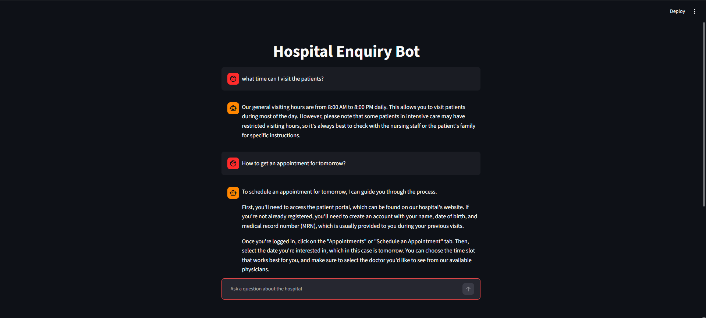
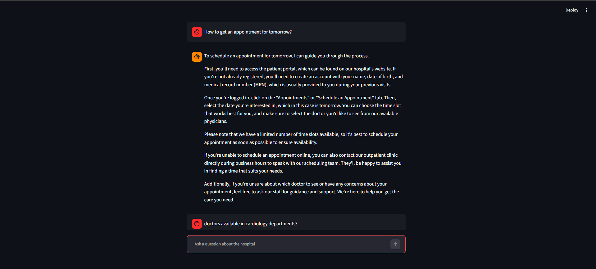
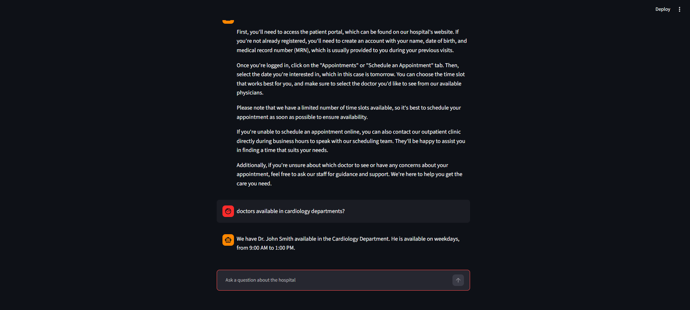

# 🏥 Hospital Enquiry Chatbot using RAG

A Retrieval-Augmented Generation (RAG) based Hospital Enquiry Chatbot built using LangChain, FAISS, Google Gemini, and Streamlit. The chatbot retrieves relevant information from a hospital knowledge base and generates accurate, context-aware responses to user queries.

---

## 🚀 Features

* Hospital information retrieval using RAG
* Doctor availability and department details
* Visiting hours information
* Emergency service information
* Appointment enquiry support
* Streamlit-based chatbot interface
* FAISS vector database for semantic search
* Google Gemini LLM integration
* HuggingFace Embeddings for document retrieval

---

## 🛠️ Tech Stack

* Python
* Streamlit
* LangChain
* Google Gemini
* FAISS
* HuggingFace Embeddings
* Sentence Transformers
* FastAPI (Optional Backend)

---

## 📂 Project Structure

```text
RAG_Hospital/
│
├── main.py              # Streamlit User Interface
├── rag.py               # RAG Pipeline
├── app.py               # FastAPI Backend
├── config.py            # API Keys Configuration
├── hospital.txt         # Hospital Knowledge Base
├── screenshots/         # Application Screenshots
├── requirements.txt
├── .gitignore
└── README.md
```

---

## ⚙️ Configuration

Create a `config.py` file in the project root directory:

```python
GOOGLE_API_KEY = "your_google_api_key"
```

Import the API key in your code:

```python
from config import GOOGLE_API_KEY
```

---

## 🔄 How It Works

```text
User Query
    ↓
Embedding Model
    ↓
FAISS Vector Store
    ↓
Retrieve Relevant Chunks
    ↓
LLM Model
    ↓
Final Response
```

1. User enters a hospital-related question.
2. The query is converted into vector embeddings.
3. FAISS retrieves the most relevant document chunks.
4. Retrieved context is passed to Gemini.
5. Gemini generates a context-aware response.
6. The answer is displayed in the Streamlit interface.

---

## 📦 Installation

### Clone the Repository

```bash
git clone https://github.com/Siyad19/Hospital-Enquiry-Chatbot-RAG.git

cd Hospital-Enquiry-Chatbot-RAG
```

### Create Virtual Environment

```bash
python -m venv venv
```

### Activate Virtual Environment

Windows:

```bash
venv\Scripts\activate
```

### Install Dependencies

```bash
pip install -r requirements.txt
```

---

## ▶️ Run the Application

Start the Streamlit application:

```bash
streamlit run frontend.py
```

The application will be available at:

```text
http://localhost:8501
```

---

## 📸 Screenshots


```markdown



```


---

## 💬 Sample Questions

* What are the hospital visiting hours?
* Which doctor is available in Cardiology?
* When is Dr. Sarah Johnson available?
* Is emergency service available 24 hours?
* What are the laboratory timings?
* How can I book an appointment?
* Which doctors are available on Saturday?

---

## 🎯 Future Improvements

* Multi-document RAG support
* PDF upload and indexing
* Voice-based interaction
* Appointment booking integration
* Patient report summarization
* Authentication and user management
* Cloud deployment

---

## ⭐ If you found this project useful, consider giving it a star on GitHub!
